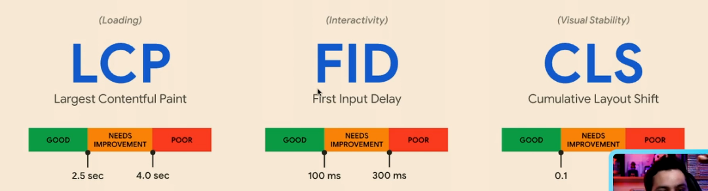
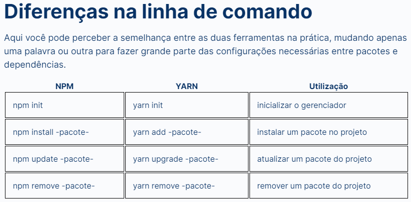

# Next.js: Explorando o framework

Vercel - empresa por tras do next

Curso recomendado: Performance Web I: otimizando o front-end

Métricas para ver se o site está bom: 

React por padrao é client side render e isso faz o site demorar para carregar na primeira vez, por isso devemos mudá-lo para serverr side render

Documentação Next.js: https://nextjs.org/

Diferença NPM e Yarn: 

getStaticProps = roda apenas no build (dê preferencia para esse pois ele roda mais rapido) EM MODO DEV SEMPRE RODA A CADA ACESSO
getServerSideProps = roda a cada acesso que voce recebe (apenas use se for realmente necessario) EM MODO DEV SEMPRE RODA A CADA ACESSO

SSG - Static Side Generating
SSR - Server Side Rendering
ISG - Incremental Static Generation (praticamente a mistura dos 2)

