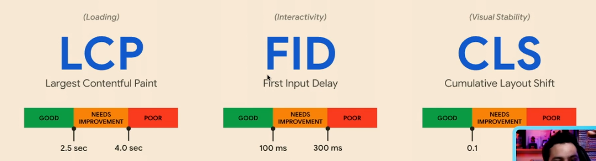

# Formação Next.js

Vercel - empresa por tras do next

Curso recomendado: Performance Web I: otimizando o front-end

Métricas para ver se o site está bom: 

React por padrao é client side render e isso faz o site demorar para carregar na primeira vez, por isso devemos mudá-lo para serverr side render

