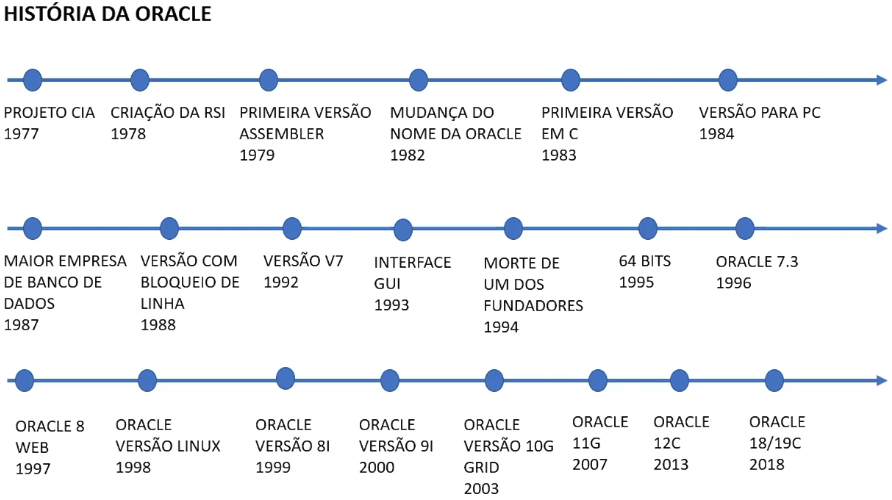

# Curso: SQL com Oracle Database: manipule e consulte dados

## Anotações

<h1>Grupos de comandos SQL:</h1>
DDL (é o conjunto de comandos para criação das entidades do banco de dados relacional):
 - CREATE: cria uma base de dados em uma tabela  
 - ALTER: altera as propriedades da estrutura dos componentes do banco (indice, tabela, banco, etc)  
 - TRUNCATE: apaga de forma definitiva os dados de uma tabela  
 - DROP: apaga realmente o componente da estrutura de dados   

DML ( é o conjunto de comandos para manipular os dados de um banco de dados relacional):
 - INSERT: inclui dados dentro de uma tabela 
 - UPDATE: altera dados de uma tabela já existente 
 - DELETE: apaga os dados de uma tabela 
 - LOCK: gerencia a concorrência da atualização de dados na mesma tabela  

DCL ( é o conjunto de comandos para controlar o banco de dados relacional):
 - COMMIT: salva o estado do banco de dados de forma definitiva no disco rígido 
 - ROLLBACK: retorna o estado de um banco de dados a partir de uma ponto salvo previamente 
 - SAVEPOINT: salva o ponto previamente  

<h1>História da Oracle</h1>

<h1>Entidade de um banco de dados</h1>

<h1>Tipos de campos</h1>

