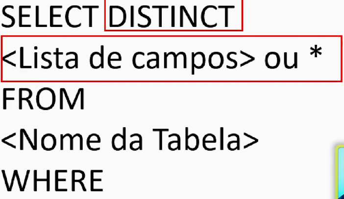
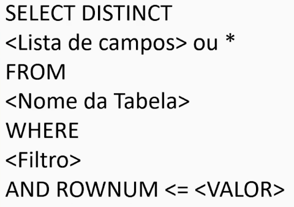
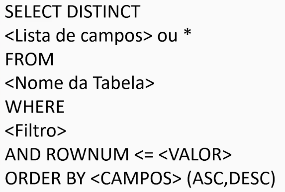
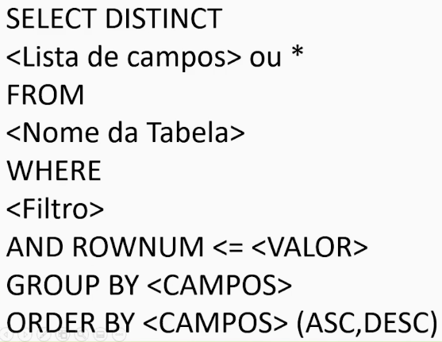
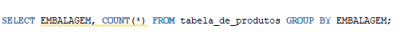

# Oracle Database: projeções, seleções, joins e views

    Para criar um alias para a tabela basta colocar um espaço e o nome da tabela:
    <code>SELECT CPF AS IDENTIFICADOR, NOME AS "NOME DE CLUENTE", BAIRRO, CIDADE FROM tabela_de_clientes TDC;</code>

    <ul>
        <li>Aspas simples são para string: <code>'Paulo'</code></li>
        <li>Aspas duplas são para nome de alias compostos: <code>"NUMERO DE COMPRAS"</code></li>
    </ul>

 
### Select Distinct apenas mostra os valores que sao diferentes

### Limitando a saíada da consulta

### Ordenando a saida

### Agrupando linhas

